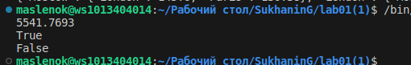

# Отчет по лабораторной работе №1
## Задание № 1
Составить словарь словарей расстояний между ними используя данную формулу:
$distances =\sqrt{((x_1 - x_2) ^ 2 + (y_1 - y_2) ^ 2)}$
## Результаты вычислений

## Задание № 2
Первая часть задания вывести на консоль значение площади круга с точностю до 4-х знаков после запятой
Формула для нахождения площади круга:
$S_к = R^2 * \pi$
Вторая часть задания даны координаты точки, если точка лежит внутри того самого круга [центр в начале координат (0, 0), radius = 42], то вывести на консоль True, Или False, если точка лежит вовне круга.
## Результаты вычислений

## Задание № 3
Расставить знаки операций "плюс", "минус", "умножение" и скобки между числами "1 2 3 4 5" так, что бы получилось число "25".
## Результаты вычислений

## Задание № 4
Выведите на консоль с помощью индексации строки, последовательно:
первый фильм
последний
второй
второй с конца
## Результаты вычислений

## Задание № 5
Создать список элементов (членов семейства) и список приблизительного их роста. Вывести на консоль рост отца, общий рост всей семьи.
## Результаты вычислений

## Задание № 6
Дан список животных в зоопарке, посадите медведя (bear) между львом и кенгуру и выведите список на консоль, добавьте птиц из списка birds в последние клетки зоопарка и выведите список на консоль, уберите слона и выведите список на консоль, выведите на консоль в какой клетке сидит лев (lion) и жаворонок (lark). Номера при выводе должны быть понятны простому человеку, не программисту.
## Результаты вычислений

## Задание № 7
Дан список песен группы Depeche Mode, распечатать общее время звучания трех песен: 'Halo', 'Enjoy the Silence' и 'Clean' в формате "Три песни звучат ХХХ.XX минут", и распечатать общее время звучания других трех песен: 'Sweetest Perfection', 'Policy of Truth' и 'Blue Dress' в формате "А другие три песни звучат ХХХ минут".
## Результаты вычислений

## Задание № 8
Дано зашифрованное сообщение. Нужно его расшифровать и вывести на консоль в удобочитаемом виде.
## Результаты вычислений

## Задание № 9
Даны два списка цветов растущих в саду и на лугу, создать множества и вывести на консоль все виды цветов, вывести которые растут и там и там, которые растут в саду, но не растут на лугу, растут на лугу, но не растут в саду.
## Результаты вычислений

## Задание № 10
Дан словарь магазинов с распродажами, создать словарь цен на продукты следующего вида.
## Результаты вычислений

## Задание №  11
Дан словарь кодов товаров и словарь списка кол-ва товаров на складе.
Рассчитать на какую сумму лежит каждого товара на складе.
## Результаты вычислений

## Список использованных источников:
1. [Markdown Cheat Sheet](https://www.markdownguide.org/cheat-sheet/)
2.  [Подробная информация об обратных срезах](https://clck.ru/MfEMS)
3. [Статья о работе с множествами](https://skillbox.ru/media/code/mnozhestva-v-python-vvodnyy-gayd-dlya-nachinayushchikh/)
## Шпаргалка по работе с командами git
git add - добавление файлов в индекс 
git status - проверка статуса репозитория 
git commit - добавление файлов в репозиторий 
git restote - отмена изменений 
git push - отправка изменений в удаленный репозиторий 

