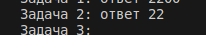
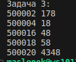

# Отчёт по лабораторной работе № 2
## Задание № 1
Ученица составляет 5-буквенные слова из букв ГЕПАРД. При этом в каждом слове ровно одна буква Г, слово не может начинаться на букву А и заканчиваться буквой Е. Какое количество слов может составить ученица?

## Результаты вычислений
Я использовал модуль itertools и функцию product со значением repeat = 5, для того чтобы узнать все слова, потом задал условие что буква Г не должна повторяться, слово не может начинаться на букву и А и кончаться буквой Е.

## Задание № 2
Значение выражения 536+524−25 5^{36} + 5^{24} − 25 536+524−25 записали в системе счисления с основанием 5. Сколько цифр 4 содержится в этой записи? 
## Результаты вычислений
Для начала создал переменную для выражения, запустил цикл в котором остаток от деления на 5 добавляется в строку r, после завершения цикла в строке r записано число в системе счисления с основанием 5, после подсчитал кол-во четверок в записи.

## Задача № 3
Найдите 5 чисел больших 500000, таких, что среди их делителей есть число, оканчивающееся на 8, при этом этот делитель не равен 8 и самому числу. В качестве ответа приведите 5 наименьших чисел, соответствующих условию.
Формат вывода: для каждого из 5 таких найденных чисел в отдельной строке сначала выводится само число, затем минимальный делитель, оканчивающийся на 8, не равный 8 и самому числу.
## Результаты вычислений
Создал цикл который проходит по всем i в диапазоне 500.000 - 600.000, для каждого i ищутся делители d из диапазона 18, (i/2 + 1), далее проверяются два условия d является делителем i, если d найден, увеличивается счетчик переменной c, и программа выводит число i и его делитель d, если c = 5 программа прекращает выполнение

## Список используемых материалов
1. [Itertools в Python - Хабр](https://habr.com/ru/companies/otus/articles/529356/)
2. [Итерируем правильно: 20 приемов использования в Python модуля itertools](https://proglib.io/p/iteriruemsya-pravilno-20-priemov-ispolzovaniya-v-python-modulya-itertools-2020-01-0)