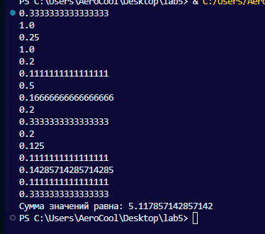

# Отчет по лабораторной работе № 5
## Задание
Генератор цифр числа π. Поделите каждую цифру на её квадрат и найдите сумму этих значений. 

Я написал функцию-генератор возвращающее символы по индексу и делю их на их квадрат, после прибавлюю к переменной i отвечающей за индекс по одному, далее добавил исключение т.к второй символ у нас точка а она нам не нужна, далее написал функцию создающую список из моего цикла и с помощью команды reduce нашел сумму всех значений
## Результаты вычислений

# Используемые материалы
### [Генераторы в Python / Хабр](https://habr.com/ru/articles/866616/)
### [Встроенные функции map, filter, и reduce в Python](https://pyhub.ru/python-advanced/lecture-10-32-69/)