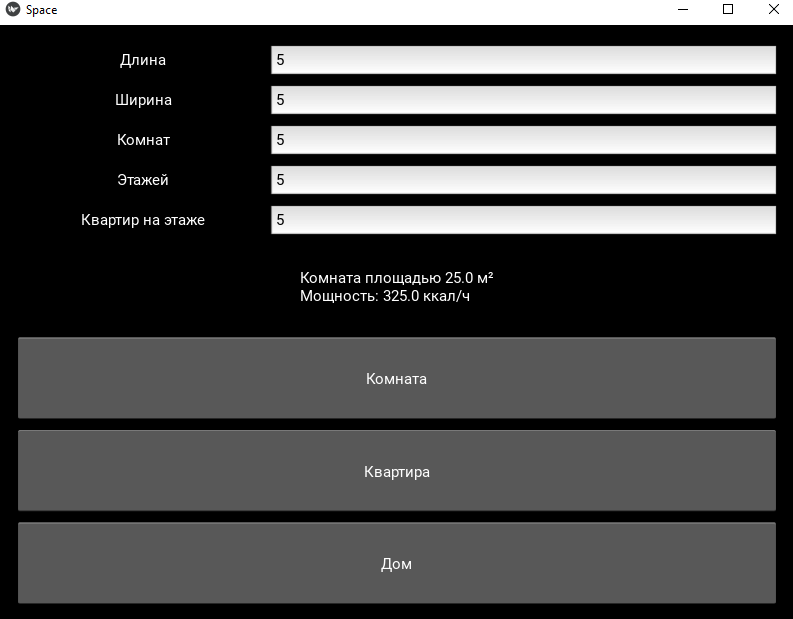
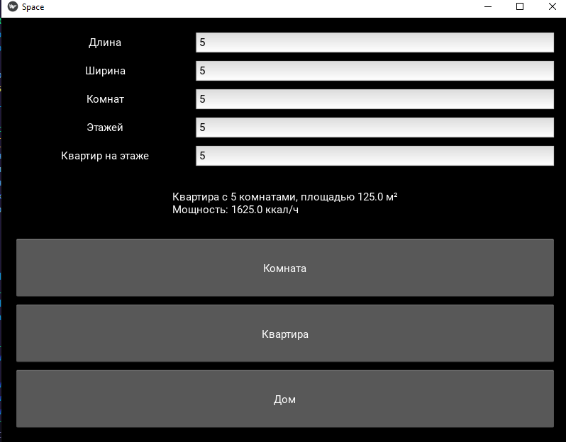
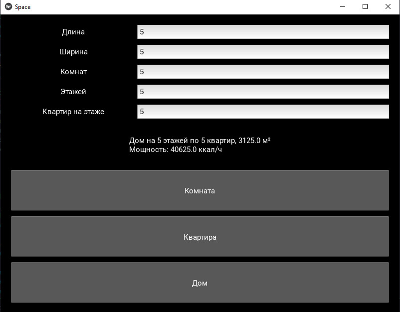

# Отчет по лабораторной работе №7

## Задание  
Разработать приложение на Python с использованием библиотеки Kivy, которое позволяет вычислять:  
- площадь помещения (в м²),  
- и требуемую тепловую мощность (в ккал/ч),  

для следующих типов объектов:  
1. Комната  
2. Квартира  
3. Многоэтажный дом

Приложение должно быть реализовано с применением принципов объектно-ориентированного программирования (ООП), включая:  
- абстрактный базовый класс,  
- декораторы (например, `@property`),  
- наследование,  
- managed-атрибуты,  
- наличие как минимум двух dunder-методов в каждом классе.

---

## Выполнение работы

1. Абстрактный класс `Space`  
   Я создал базовый абстрактный класс Space с атрибутами length и width, а также вычисляемым свойством area (через декоратор @property`). В этом же классе реализован абстрактный метод `heating_power, который определяет, как рассчитывается мощность отопления в подклассах.

2. Класс `Room`  
   Наследует Space, реализует метод heating_power, вычисляя мощность по формуле area * 13. Также реализованы dunder-методы __eq__ (сравнение по площади) и __len__ (возвращает округлённую площадь).

3. Класс `Apartment`  
   Наследует Room и добавляет параметр rooms. Переопределяет area, чтобы учитывать количество комнат (`super().area * self.rooms`). Также реализует __str__ и __len__.

4. Класс `Building`  
   Наследует Apartment, добавляет параметры floors и flats_per_floor. Общая площадь теперь рассчитывается с учетом этажей и количества квартир. Также реализованы методы __str__ и __len__.

5. Kivy-интерфейс (`Interface`)  
   Через BoxLayout реализован простой интерфейс с полями ввода (длина, ширина, комнаты, этажи, квартиры на этаже) и тремя кнопками:
   - "Комната"
   - "Квартира"
   - "Дом"

   При нажатии создается соответствующий объект (`Room`, Apartment или `Building`) и рассчитываются:
   - Площадь
   - Мощность отопления

   Результаты выводятся в Label.

---

## Результат работы  
Созданное приложение позволяет интерактивно вводить параметры и моментально получать расчет:  
- площади помещения (с учетом этажей и количества квартир),  
- требуемой мощности обогрева (в ккал/ч).

---

Рассчет комнаты

Рассчет квартиры

Расчет дома

## Используемые источники

1. [Официальная документация Python: abc — Abstract Base Classes](https://docs.python.org/3/library/abc.html)  
2. [Официальная документация Kivy](https://kivy.org/doc/stable/)  
3. [Python: Декоратор `@property`](https://docs.python.org/3/library/functions.html#property)  
4. [Принципы ООП в Python (habr.com)](https://habr.com/ru/companies/otus/articles/517996/)  
5. [Методы str, repr, len, eq в Python (realpython.com)](https://realpython.com/python-data-model/)