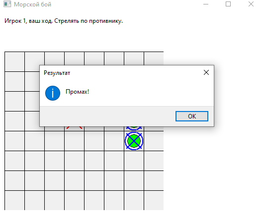

# Отчет по лабораторной работе № 8

## Задание

Реализовать игру "Морской бой" с графическим интерфейсом (GUI) с использованием фреймворка `wxPython`.  
Игра должна быть написана с использованием объектно-ориентированной парадигмы, обработкой исключений через собственные классы исключений и интерфейсом, позволяющим играть вдвоём за одним компьютером.

## Ход работы

Я реализовал классическое поле 8×8 и возможность расстановки кораблей двумя игроками по очереди.  
Было реализовано:

- Расстановка кораблей: 3 одноклеточных, 2 двухклеточных, 1 трёхклеточный.
- Интерфейс через `wxPython` с отрисовкой полей, кораблей, выстрелов, попаданий и промахов.
- При попадании ход остаётся у игрока, при промахе — переходит к другому.
- Потопленные корабли отображаются с синей обводкой и зачёркнуты.
- После завершения расстановки игроки не видят поле соперника.
- Реализованы собственные исключения при некорректной расстановке кораблей.
- Ходы делаются по очереди, интерфейс блокирует возможность сделать несколько ходов подряд.

Также были добавлены всплывающие сообщения о попаданиях, промахах, потоплениях и победе.

## Результаты
Игра происходит по правилам классического "Морского боя".

 

Расставление кораблей

 

Корабль уничтожен

 

Уничтоженный корабль обводится и перечеркивается

 

Сообщение при промахе

## Используемые материалы

- [Введение в wxPython / python-scripts.com](https://python-scripts.com/wxpython)  
- [GUI на wxPython / Хабр](https://habr.com/ru/articles/137369/)
