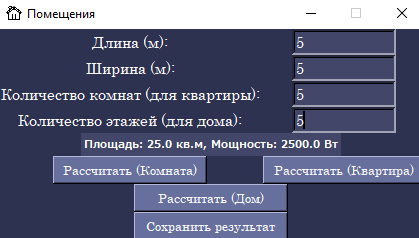
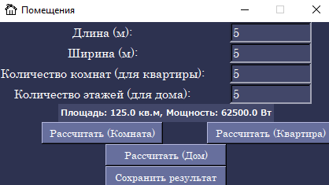
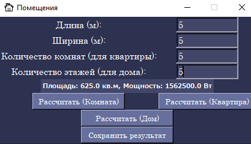
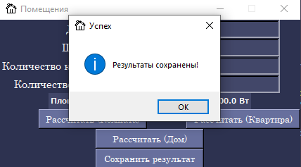
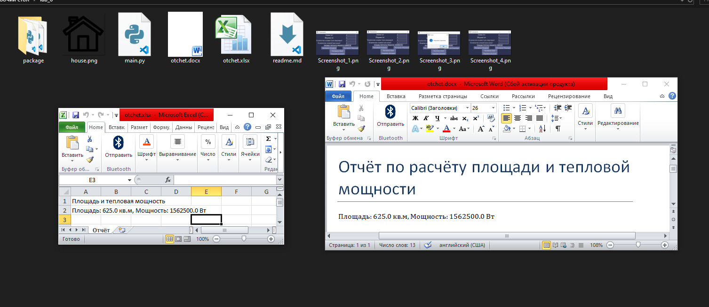

## Отчёт по лабораторной работе № 6

## Задание

Реализовать программу с графическим интерфейсом (на Tkinter) для расчёта площади и объёма закупок отделочных материалов: обоев, плитки и ламината. Реализовать 3 отдельных модуля (класса): Wallpaper, Tile, Laminate.

Выходные данные: площадь, цена за единицу и расчёт необходимого количества и общей стоимости.

## Ход работы

Я реализовал основную программу с интерфейсом Tkinter. В ней пользователь вводит длину и ширину помещения, цену за единицу и площадь обоин/ламината/плитки. Далее строго объектно-ориентированно реализованы 3 класса, каждый в отдельном модуле:
 • Wallpaper: вычисляет, сколько рулонов обоев потребуется и сколько это будет стоить;
 • Tile: то же самое, но с плиткой;
 • Laminate: вычисление кол-ва пакетов ламината.

Вывод происходит на экран, есть кнопка для сохранения отчёта в формате Word (импортируется python-docx) и Excel (openpyxl).

Кнопка сохраняет данные из полей ввода, а также расчёты в Word и Excel файлы в папку с проектом.

## Результат

 

Рассчет комнаты

 

Рассчет квартиры

Рассчет всего дома

 

Сохранение результата

 

Сохранение результата

В результате было реализовано приложение для вычисления количества отделочных материалов и их стоимости. Графический интерфейс позволяет вводить данные и выбирать тип отделочного материала. Дополнительно реализована функция сохранения отчётов.

## Используемые материалы
[Tkinter documentation](https://docs.python.org/3/library/tkinter.html)  
[python-docx documentation](https://python-docx.readthedocs.io/en/latest/)  
[openpyxl documentation](https://openpyxl.readthedocs.io/en/stable/)  