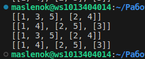
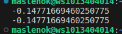

# Отчет по лабораторной работе № 3
## Задание № 1
Написать функцию, которая разделяет список на n-частей. Для рекурсии функция split1 делит список на части с использованием рекурсии и выбирает каждый n-ый элемент в текущем вызове. В результате получается список списков, где каждый внутренний список содержит одну из частей исходного списка. Для итерации Функция split2 разбивает исходный список на заданное количество подсписков (n) и распределяет элементы между ними циклически. Если количество подсписков больше длины списка, каждый элемент будет помещен в отдельный подсписок.
## Результаты вычислений

## Задание № 2
Написать функцию для расчёта $v_i = \frac{i + 1}{i^2 + 1} * v_{i-1} - v_{i-2} * v_{i-3}. v_i = v_2 = 0, v_3 = 1.5.$
Для рекурсии, задал если i равно 1 или 2 возвращается 0, если i равно 3 возвращается 1.5, в остальном случае функция считает значение по формуле. 
Для итерации аналогично рекурсивному подходу, если n равно 1 или 2, функция возвращает 0, если n равно 3, функция возвращает 1.5. Создаю массив v длиной n + 1, который будет хранить значения для всех индексов от 0 до n. Далее с помощью цикла for от 4 до n, функция вычисляет значения для каждого индекса i по той же формуле, что и в рекурсивном подходе,но вместо рекурсивных вызовов здесь просто используются уже вычисленные значения из массива.
## Результаты вычислений

## Используемые материалы в ходе работы:
1. [🐍 Самоучитель по Python для начинающих. Часть 13: Рекурсивные функции - proglib.io](https://proglib.io/p/samouchitel-po-python-dlya-nachinayushchih-chast-13-rekursivnye-funkcii-2023-01-23) 
2. [Как работает рекурсия – объяснение в блок-схемах и видео - Хабр](https://habr.com/ru/articles/337030/)

