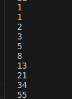

# Отчет по лабораторной работе № 4
## Задание 1
Замыкание реализующее последовательность Фибоначчи. Я написал код создающий генератор чисел Фибоначчи, за счет вложенной функции и механизма замыкания при каждом вызове возвращает следующее число в последовательности
## Результаты вычислений

## Задание 2
Написать декоратор для кэширования результатов выполнения функций. Функция cache(func) создает декоратор, который кэширует результаты вызовов функции func. Хранит результаты в словаре cache_dict, где ключами являются аргументы, а значениями — результаты вычислений. Функция fib. Инициализирует переменные a и b для хранения текущих чисел Фибоначчи (0 и 1). Вложенная функция next_fib(n)Декорируется с помощью @cache, что позволяет кэшировать результаты для каждого значения n. Если n равно 0, возвращает текущее значение a. В противном случае обновляет значения a и b и возвращает текущее значение s, которое является предыдущим значением Фибоначчи. 
## Результаты вычислений

## Список используемых материалов
1. [Замыкания](https://metanit.com/python/tutorial/2.19.php)
2. [Декоратор](https://habr.com/ru/companies/otus/articles/727590/)
